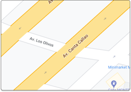

# **Informe** 
## **Introducción**
Las aplicaciones de mapas nos brindan, no solo direcciones detalladas hacia un destino determinado, pero también, información adicional sobre las características de las rutas, tales como el tiempo que nos tomará viajar por ellas y  el nivel de tráfico. Asimismo, nos muestran alternativas a la ruta principal, para que el usuario pueda elegir la que le sea más conveniente. 

Muchas de las funcionalidades principales que estas aplicaciones tienen pueden ser simuladas con diferentes estructuras de datos y algoritmos de búsqueda de grafos. Por esta razón, en el presente proyecto, se elaborará una mapa de calles similar a "Waze", donde podremos hallar diferentes rutas entre 2 puntos, tomando en cuenta factores de tiempo y tráfico. Además, se pondrá enfásis al diseño de algoritmos para hallar los factores y las rutas más optimas. 

## **Objetivos**
- Consolidar los conocimientos adquiridos en el curso de Complejidad Algorítmica en un proyecto integrador.
- Poner en práctica la capacidad de resolución de problemas y organización de tiempo para el proyecto.
- Encontrar una ruta óptima entre 2 puntos determinados.

## **Elaboración del grafo**
### **Registro de calles**
Nosotros registramos el nombre de cada calle y el nombre de las calles con las que cada una se interseca. En código, a cada calle le asignamos un identificador numérico y lo guardamos en un diccionario al que llamamos streetsDictionary, donde las keys son los nombres de las calles y los values son los identificadores.
### **Vértices del grafo**
En el programa, cada calle del grafo está identificado por un número. La Avenida Los Olivos, por ejemplo, se representa con el número 62. Asimismo, la Avenida Canta Callao está representada por el número 30. De esta forma, los vértices del grafo representan una intersección entre 2 calles. En la imagen, por ejemplo, se puede observar el vértice (62, 30).

## **Conclusiones**
